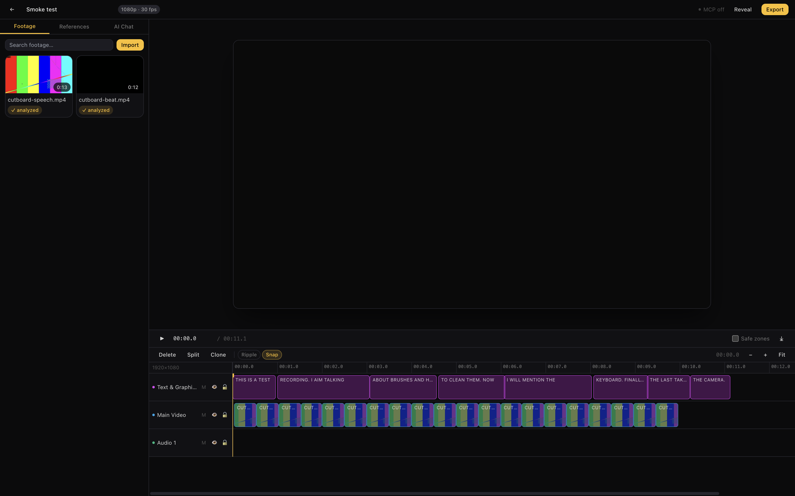

<div align="center">


### Chat-to-edit video editing. Local-first. Open source.

**Drop in raw footage. Describe the edit. Watch the real timeline update — cuts, captions,
beat sync, motion graphics — while your files never leave your machine.**

[MIT License](LICENSE) · macOS / Windows / Linux · Electron + React + ffmpeg

</div>

---

<p align="center">
  
</p>

> The screenshot above is a real session: footage imported, transcribed locally, silence
> removed, captions generated from the transcript, and the video track re-cut to the beat
> grid of a music track — all driven through the tool API, all undoable with ⌘Z.

## Why

Most AI video tools generate fake footage or ship your files to a server. Cutboard is the
opposite:

- **Edits real footage. Never generates video.** Nothing enters the output that you didn't
  import. The agent is an editor, not a slot machine.
- **Local-first.** Originals stay where they are. Transcription, scene detection, and beat
  detection run on your machine (whisper.cpp, ffmpeg, local ONNX). Cloud models are
  opt-in per capability and clearly labeled.
- **The timeline is the source of truth.** Every agent edit is a validated operation in an
  append-only log — exact undo/redo, crash recovery, and MCP clients can edit the project
  even with the window closed.
- **One tool set, every interface.** The built-in chat and any MCP client (Claude Code,
  Claude Desktop, Codex, Cursor) drive the same 30+ typed tools.

## What it does

| | |
|---|---|
| **Footage understanding** | Word-level transcript (whisper.cpp), scene detection with keyframes, optional VLM scene descriptions — all searchable (FTS5 + local embeddings). |
| **Rough cut** | Removes pauses and repeated takes, keeps your order, reports the duration. One atomic undo. |
| **Transcript editing** | "Cut to the brushes whenever I mention them" — edit by what was said, timed in milliseconds. |
| **Captions** | Serif / bold / karaoke presets generated from word timings; styled, placed, batched. |
| **Beat sync** | Local DSP beat detection (BPM, grid, downbeats, sections) → cuts land on the grid with per-section density. Verified at ±1 frame. |
| **Motion graphics** | The agent writes sandboxed scene-tree compositions (lower thirds, counters, title cards) timed to speech. Edited only via chat, with a look-and-fix loop. |
| **Reference style** | Analyze a reference video's cut rhythm and color stats; copy the properties you choose. The reference footage never enters your edit. |
| **Effects & keyframes** | Brightness/contrast/saturation/blur with keyframed animation; speed ramps and time remap. |
| **Export** | Presets for TikTok/Reels/Shorts, YouTube, Square — hardware-encoded (VideoToolbox/NVENC/QSV/AMF) with a mixed, ducked audio track. Frame-accurate: output matches the preview. Plus OTIO hand-off to Resolve/Premiere/FCP. |

## Quick start

```bash
git clone <your-fork-url> cutboard && cd cutboard
pnpm install
pnpm fetch:ffmpeg        # bundled LGPL ffmpeg/ffprobe (optional — falls back to PATH)
pnpm dev                 # apps/desktop → Electron dev server
```

1. **Create a project** and import media (⌘I).
2. **Wait for analysis** — proxies, transcript (`✓ analyzed` badge). The first ASR model
   download is ~150 MB; manage models in **Settings → AI**.
3. **Ask the agent** — open the **AI chat** tab and try the prompts in
   [`docs/prompts/`](docs/prompts). Configure a provider (Anthropic / OpenAI / Google, or
   run fully local with [Ollama](https://ollama.com)) in the chat's ⚙ AI settings.

> Verified smoke run on Apple Silicon: 12.6s speech clip → analyzed in ~20s (base.en),
> silence removal cut 2.5s, 8 karaoke caption cards, 121 BPM detected on a 120 BPM click
> track, 20 beat-synced cuts, 1080p export.

## Drive it from your own agents (MCP)

Cutboard ships a **local MCP server** (loopback only, per-install bearer token). Enable it
in **Settings → MCP**, then:

```bash
# Claude Code
claude mcp add --transport http cutboard http://127.0.0.1:8629/mcp \
  --header "Authorization: Bearer <token from Settings>"

# Codex / Cursor / Claude Desktop — see the copy-paste snippets in Settings → MCP,
# or use the stdio shim:  npx cutboard-mcp
```

Privacy: external agents receive text (transcripts, scene descriptions, timeline JSON)
and frames only when they call `captureFrame` — never your source files.

## Architecture

```
┌─────────────────────────── Desktop app (one install) ───────────────────────────┐
│ Renderer (React editor, canvas compositor, sandboxed motion-graphics iframe)     │
│      ▲ typed IPC (contextBridge, zod-validated, sandboxed preload)               │
│ Main process — source of truth                                                   │
│   ├─ Project service   SQLite (WAL) + append-only op log, undo/redo              │
│   ├─ Tool registry     30+ zod-typed tools — chat and MCP share one catalog      │
│   ├─ Agent runtime     Vercel AI SDK → Anthropic / OpenAI / Google / Ollama      │
│   ├─ MCP server        127.0.0.1 Streamable HTTP + token + stdio shim            │
│   ├─ Job manager       resumable ingest/export queue (SQLite-backed)             │
│   └─ Analysis          whisper.cpp ASR · scene detect · beats DSP · embeddings   │
│ Sidecars: bundled ffmpeg/ffprobe (LGPL) · hidden render window → hw encode       │
└──────────────────────────────────────────────────────────────────────────────────┘
```

Timeline state lives in the main process and changes **only through ops** (`item.trim`,
`item.split`, `batch`, …). The UI, the built-in agent, and MCP clients are all just
clients of the same op log — which is why undo works everywhere and agents can edit
headless. Core op semantics (ripple, split, trim, inverses) are pure TypeScript with
46 unit tests (`packages/editor-core`).

## Repository layout

```
apps/desktop        Electron app (main / preload / renderer)
apps/mcp-shim       stdio ⇄ loopback-HTTP bridge for MCP clients
packages/schema     zod data model + op catalog (single source of truth)
packages/editor-core  pure op engine: apply/invert, ripple, snapping, history
packages/tools      tool catalog shared by chat + MCP
packages/renderer   canvas compositor + motion-graphics runtime + validators
packages/agent      system prompt, provider notes
scripts/            logo generator, ffmpeg/whisper fetchers
docs/               decisions, prompts, screenshots
```

## Packaging

```bash
pnpm --dir apps/desktop dist        # signed builds need certs; unsigned otherwise
pnpm --dir apps/desktop dist:dir    # fast unpacked build (mac verified)
```

Config in `apps/desktop/electron-builder.yml` (dmg / NSIS / AppImage). Bundled ffmpeg is
LGPL — no GPL components; see [`THIRD_PARTY_LICENSES.md`](THIRD_PARTY_LICENSES.md) for the
codec distribution notes.

## Status & roadmap

Shipped: all ten desktop milestones — see [`docs/DECISIONS.md`](docs/DECISIONS.md) for
every resolved decision and [`docs/prompts/`](docs/prompts) for copy-paste agent prompts.

Next up, in rough order: mask tracking + SAM-based background removal (ONNX sidecar),
project bundle portability (per-project `project.db`), batch-over-folder flows, signed +
notarized installers, stock media search (Pexels/Freesound).

## Contributing

PRs welcome. `pnpm test` (vitest), `pnpm typecheck`, `pnpm lint` should all pass —
`packages/editor-core` changes need tests. Keep the privacy rule sacred: nothing leaves
the machine unless the user explicitly configured a cloud provider for that capability.

## License

MIT — see [LICENSE](LICENSE). The wordmark embeds
[Montserrat](https://fonts.google.com/specimen/Montserrat) (SIL OFL 1.1) as outlines.
Not affiliated with any commercial product.
